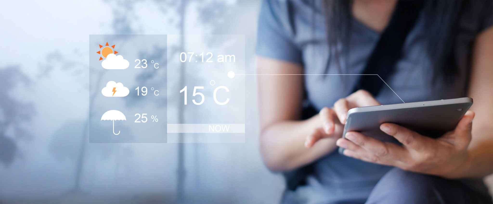

# MY WEATHER APP - Android mini project

## Motivation :
- No one can imagine how the weather is going to be on a subsequent day. 
- Definitely, the Weather forecast is a big thing that enabled many of us to stay notified about the changes in climatic conditions beforehand. 
- It can be said that it is one of the greatest advancements of all time, mothered by innovative technologies and creative thoughts. 
- Having an up to date information about the weather helps us to take well-read decisions.
- These weather apps constantly update the forecasts for a day or hour or sometimes for even a minute. 
- These can be simply termed as the compact weather devices, as they do not only tell about the temperature of that specific region; instead they can describe the accurate time of the sunrise and sunset, the time of the rainfall, humidity levels, etc.

> The furtherance of weather forecasting is - **WEATHER APP DEVELOPMENT**

> Project Demo : [Click here to know more](https://gudivaraprasad.github.io/Android-Weather-App/APK/)

> UML Diagrams : [Click here](https://gudivaraprasad.github.io/Android-Weather-App/Files/UML%20Diagrams/)

> Project Report : [Click here](https://gudivaraprasad.github.io/Android-Weather-App/APK/Files/Report.pdf)

> Project Presentations : [Click here](https://gudivaraprasad.github.io/Android-Weather-App/APK/Files)
